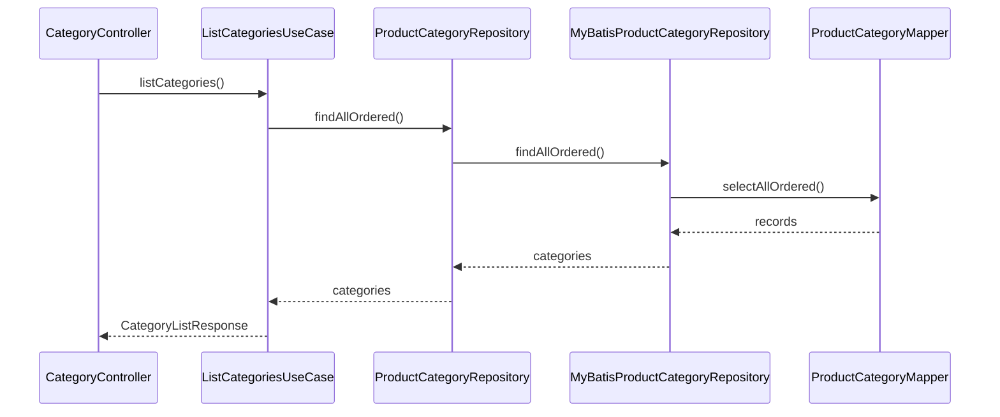
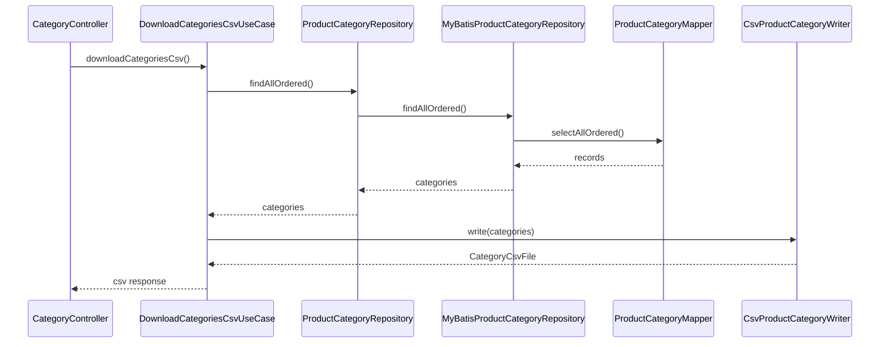
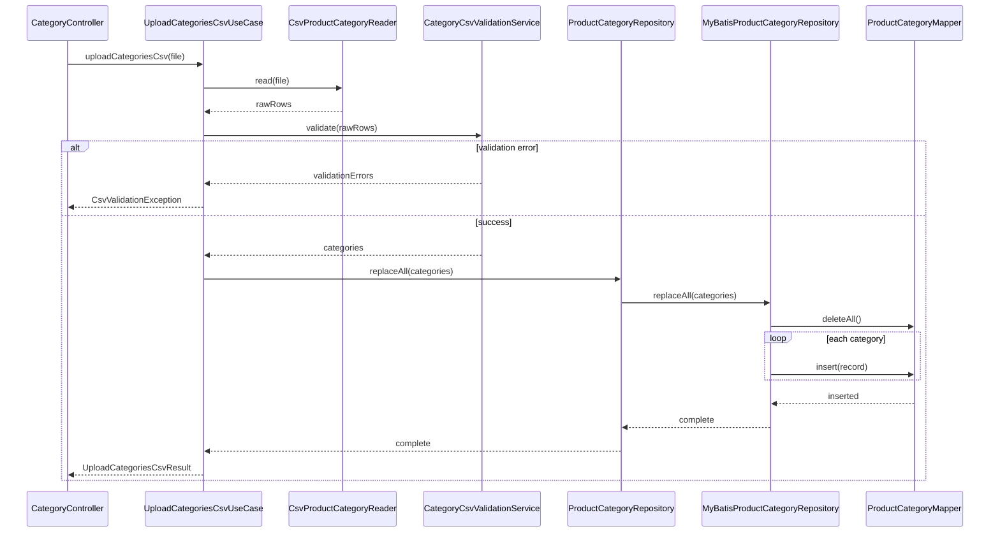

# 商品カテゴリマスター管理システム MVP バックエンド詳細設計

## 1. 目的

本ドキュメントは、[basic-design.md](/Users/massakai/github/master-management-playground/docs/basic-design.md) をもとに、バックエンド実装の詳細設計を定義する。

対象は `Spring Boot`、`MyBatis`、`Apache Commons CSV` を利用した商品カテゴリマスター管理 API であり、DDD を意識したレイヤ構成で実装する。

## 2. 対象機能

- 商品カテゴリ一覧取得
- 商品カテゴリ CSV ダウンロード
- 商品カテゴリ CSV アップロード
- CSV バリデーション
- 正常時の全件入れ替え更新

## 3. レイヤ構成

### 3.1 パッケージ構成

```text
backend/
  └─ src/main/java/com/example/mastermanagement
      ├─ presentation
      │   └─ category
      ├─ application
      │   └─ category
      ├─ domain
      │   └─ category
      └─ infrastructure
          ├─ persistence
          │   └─ category
          ├─ csv
          │   └─ category
          └─ config
```

### 3.2 レイヤ責務

| レイヤ | 責務 |
| --- | --- |
| Presentation | HTTP リクエスト受理、レスポンス返却、DTO 変換 |
| Application | ユースケース実行、トランザクション制御、ドメインと外部入出力の調停 |
| Domain | 業務ルール、エンティティ整合性、値オブジェクト、Repository 抽象 |
| Infrastructure | DB 永続化、CSV 読み書き、MyBatis Mapper、設定 |

## 4. API 対応

| API | UseCase | 主な処理 |
| --- | --- | --- |
| `GET /api/categories` | `ListCategoriesUseCase` | 商品カテゴリ一覧取得 |
| `GET /api/categories/csv` | `DownloadCategoriesCsvUseCase` | 一覧取得後に CSV 出力 |
| `POST /api/categories/csv` | `UploadCategoriesCsvUseCase` | CSV 読み込み、検証、全件入れ替え |

OpenAPI の正本は [openapi.yaml](/Users/massakai/github/master-management-playground/docs/openapi.yaml) とする。

## 5. クラス設計

### 5.1 Presentation

#### `CategoryController`

- 役割:
  - 商品カテゴリ API のエンドポイントを提供する
- エンドポイント:
  - `GET /api/categories`
  - `GET /api/categories/csv`
  - `POST /api/categories/csv`
- 依存:
  - `ListCategoriesUseCase`
  - `DownloadCategoriesCsvUseCase`
  - `UploadCategoriesCsvUseCase`

#### DTO

| クラス | 役割 |
| --- | --- |
| `CategoryResponse` | 一覧表示用レスポンス |
| `CategoryListResponse` | 一覧 API のラッパー |
| `CategoryCsvUploadResponse` | CSV 更新成功レスポンス |
| `CsvValidationErrorResponse` | CSV エラー明細 |
| `ErrorResponse` | 想定外エラー応答 |

#### `GlobalExceptionHandler`

- 役割:
  - 業務例外とシステム例外を HTTP 応答へ変換する
- 主な対象例外:
  - `CsvValidationException`
  - `FileFormatException`
  - `UnexpectedApplicationException`

### 5.2 Application

#### `ListCategoriesUseCase`

- 入力:
  - なし
- 出力:
  - `List<CategoryDto>`
- 処理:
  - `ProductCategoryRepository.findAllOrdered()` を呼び出す
  - ドメインモデルを出力 DTO に変換する

#### `DownloadCategoriesCsvUseCase`

- 入力:
  - なし
- 出力:
  - `CategoryCsvFile`
- 処理:
  - `ProductCategoryRepository.findAllOrdered()` で一覧取得
  - `CsvProductCategoryWriter` で CSV バイト列生成
  - ファイル名、contentType、本文を返す

#### `UploadCategoriesCsvUseCase`

- 入力:
  - `UploadCategoriesCsvCommand`
- 出力:
  - `UploadCategoriesCsvResult`
- トランザクション:
  - 必須
- 処理:
  1. ファイル存在チェック
  2. `CsvProductCategoryReader` で CSV 構造検証と行読み込み
  3. `CategoryCsvValidationService` で業務バリデーション
  4. エラーがあれば `CsvValidationException` を送出
  5. `ProductCategoryRepository.replaceAll(categories)` を実行
  6. 更新件数を返す

#### Application DTO

| クラス | 役割 |
| --- | --- |
| `UploadCategoriesCsvCommand` | MultipartFile などの入力を保持 |
| `UploadCategoriesCsvResult` | 更新件数、メッセージを保持 |
| `CategoryDto` | 一覧・CSV 出力のアプリケーション用 DTO |
| `CategoryCsvFile` | CSV ダウンロード結果 |

### 5.3 Domain

#### 集約

##### `ProductCategory`

- 役割:
  - 商品カテゴリ集約ルート
- 属性:
  - `CategoryCode categoryCode`
  - `CategoryName categoryName`
  - `DisplayOrder displayOrder`
  - `ActiveFlag isActive`
  - `Description description`
- 生成ルール:
  - 値オブジェクト生成時に項目妥当性を検証する

#### 値オブジェクト

| クラス | 役割 | 主なルール |
| --- | --- | --- |
| `CategoryCode` | カテゴリコード | 必須、正規表現 `^[A-Za-z0-9_-]+$` |
| `CategoryName` | カテゴリ名 | 必須、空文字不可、100 文字以内 |
| `DisplayOrder` | 表示順 | 必須、整数 |
| `ActiveFlag` | 有効フラグ | `true/false` |
| `Description` | 説明 | 任意、255 文字以内 |

#### `ProductCategoryRepository`

- 役割:
  - 永続化の抽象
- メソッド:
  - `List<ProductCategory> findAllOrdered()`
  - `void replaceAll(List<ProductCategory> categories)`

#### `CategoryCsvValidationService`

- 役割:
  - CSV 行集合に対する業務バリデーション
- チェック内容:
  - `category_code` 重複
  - 各値オブジェクト生成失敗
  - データ行 1 件以上
- 出力:
  - `List<CsvValidationError>`

#### Domain 例外

| 例外 | 用途 |
| --- | --- |
| `DomainValidationException` | 単項目の妥当性エラー |
| `CsvValidationException` | 複数行の CSV エラー |

### 5.4 Infrastructure

#### 永続化

##### `MyBatisProductCategoryRepository`

- 役割:
  - `ProductCategoryRepository` の MyBatis 実装
- 依存:
  - `ProductCategoryMapper`
  - `Clock`
- 処理:
  - Mapper のレコードをドメインモデルへ変換
  - `replaceAll` 時に一括削除と一括登録を行う

##### `ProductCategoryMapper`

- 役割:
  - SQL 実行
- メソッド候補:
  - `List<ProductCategoryRecord> selectAllOrdered()`
  - `int deleteAll()`
  - `int insert(ProductCategoryRecord record)`

##### `ProductCategoryRecord`

- 役割:
  - DB 行マッピング用のインフラモデル
- 備考:
  - Domain モデルとは分離する

#### CSV

##### `CsvProductCategoryReader`

- 役割:
  - `Apache Commons CSV` を用いて CSV を読み込む
- チェック内容:
  - UTF-8 読み込み可否
  - ヘッダー完全一致
  - 行数チェック
- 出力:
  - `List<RawCategoryCsvRow>`

##### `CsvProductCategoryWriter`

- 役割:
  - `Apache Commons CSV` を用いて CSV を出力する
- 出力仕様:
  - UTF-8
  - ヘッダーあり
  - 固定列順

##### `RawCategoryCsvRow`

- 役割:
  - CSV 1 行の生データを保持
- 属性:
  - `int rowNumber`
  - `String categoryCode`
  - `String categoryName`
  - `String displayOrder`
  - `String isActive`
  - `String description`

## 6. シーケンス設計

### 6.1 一覧取得



### 6.2 CSV ダウンロード



### 6.3 CSV アップロード



## 7. バリデーション詳細

### 7.1 技術バリデーション

担当レイヤ: Infrastructure または Application

- ファイル未指定
- UTF-8 読み込み不可
- ヘッダー不一致
- ヘッダーのみ

### 7.2 業務バリデーション

担当レイヤ: Domain

- `category_code` の形式不正
- `category_code` の重複
- `category_name` 未入力
- `display_order` が整数でない
- `is_active` が `true/false` でない
- 文字数超過

### 7.3 エラー返却方針

- エラーは 1 件でもあれば更新しない
- 行単位のエラーは `rowNumber`, `field`, `code`, `message` で返す
- ファイル全体エラーは `rowNumber = null` を許容する

## 8. トランザクション設計

- `ListCategoriesUseCase`: read-only
- `DownloadCategoriesCsvUseCase`: read-only
- `UploadCategoriesCsvUseCase`: read-write

`UploadCategoriesCsvUseCase` では以下を同一トランザクションで実行する。

1. 既存データ全件削除
2. 新規データ全件登録

失敗時はロールバックする。

## 9. SQL 設計方針

### 9.1 一覧取得

- `ORDER BY display_order ASC, category_code ASC`

### 9.2 全件入れ替え

- `DELETE FROM product_category`
- 1 行ずつ `INSERT`

MVP では件数が少ない前提のため、一括更新の最適化は後回しとする。

### 9.3 日時列

- `created_at`, `updated_at` はアプリケーション側で設定する
- `replaceAll` 時は新規登録扱いのため、全件に同一の更新時刻を設定する

## 10. 設定値

| 設定項目 | 用途 | 初期方針 |
| --- | --- | --- |
| `spring.servlet.multipart.max-file-size` | 最大アップロードサイズ | MVP では小さめに制限 |
| `spring.servlet.multipart.max-request-size` | 最大リクエストサイズ | MVP では小さめに制限 |
| `app.csv.filename` | ダウンロードファイル名 | `product-categories.csv` |

## 11. テスト設計

### 11.1 Domain

- 値オブジェクトの正常系、異常系
- `CategoryCsvValidationService` の重複チェック

### 11.2 Application

- 一覧取得ユースケース
- CSV ダウンロードユースケース
- CSV アップロード正常系
- CSV バリデーション異常系
- `replaceAll` 失敗時のロールバック

### 11.3 Infrastructure

- `CsvProductCategoryReader` のヘッダー検証
- `CsvProductCategoryWriter` の列順検証
- `ProductCategoryMapper` の SQL 実行

### 11.4 Presentation

- API のステータスコード
- レスポンス JSON
- CSV ダウンロードヘッダー

## 12. 未確定事項

- Spring Boot のパッケージルート名
- DDL 管理方式
- CSV ダウンロード時の BOM 付与有無
- バルク INSERT の採用有無
