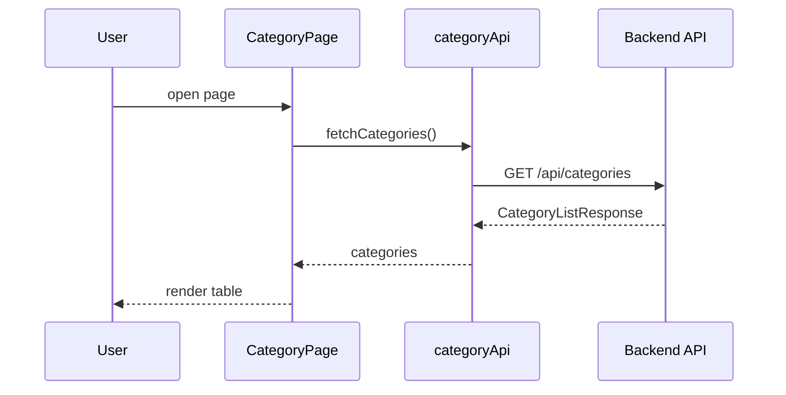
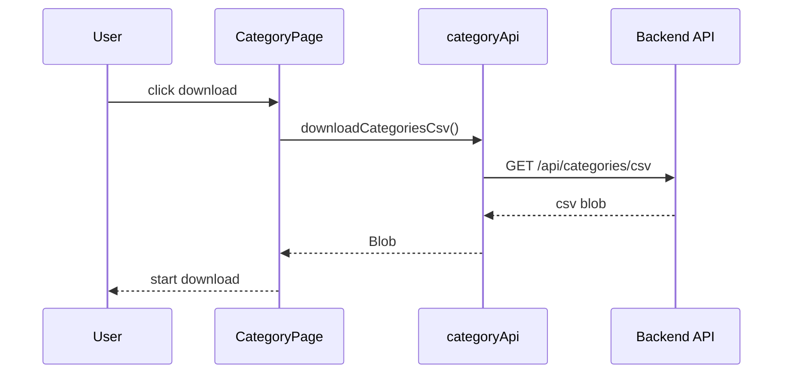
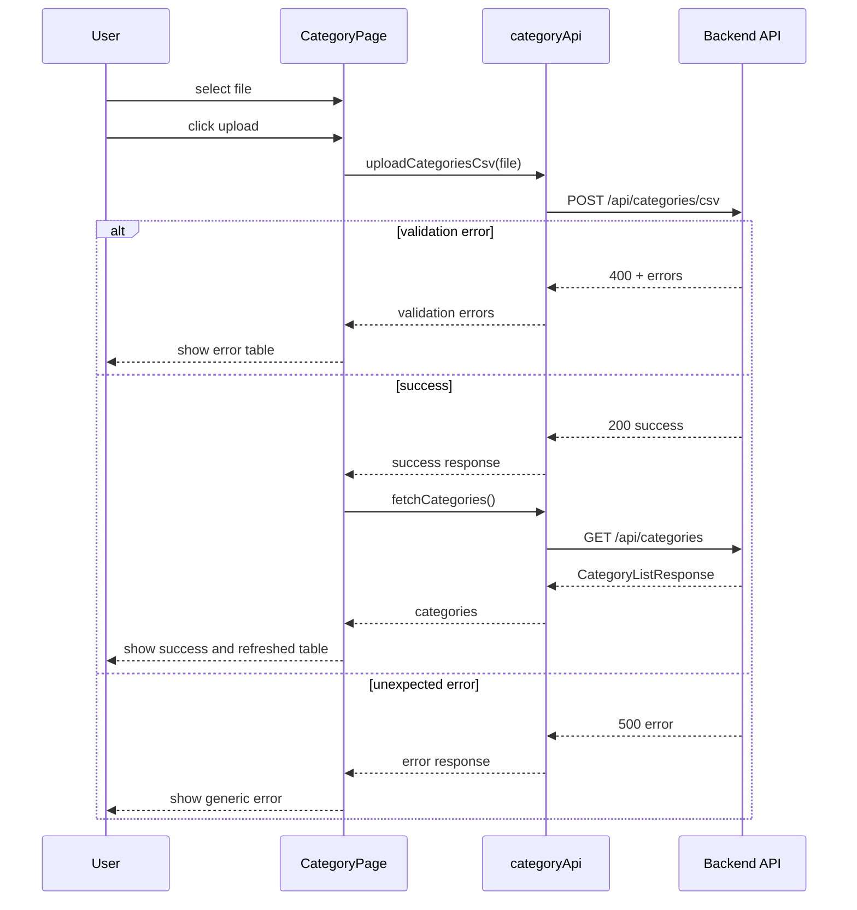

# 商品カテゴリマスター管理システム MVP フロントエンド詳細設計

## 1. 目的

本ドキュメントは、[basic-design.md](/Users/massakai/github/master-management-playground/docs/basic-design.md) と [openapi.yaml](/Users/massakai/github/master-management-playground/docs/openapi.yaml) をもとに、フロントエンド実装の詳細設計を定義する。

対象は `Vue.js 3` を利用した単一画面の UI であり、商品カテゴリ一覧表示、CSV ダウンロード、CSV アップロード、エラー表示を扱う。

## 2. 対象機能

- 商品カテゴリ一覧表示
- CSV ダウンロード
- CSV アップロード
- CSV アップロード中の状態表示
- バリデーションエラー表示
- 更新成功メッセージ表示

## 3. 画面構成

### 3.1 対象画面

- 商品カテゴリ一覧画面

### 3.2 レイアウト構成

画面は以下の 3 領域で構成する。

1. ヘッダー領域
2. CSV 操作領域
3. 一覧表示領域

### 3.3 ユーザー操作

| 操作 | 内容 |
| --- | --- |
| 初期表示 | 商品カテゴリ一覧を取得する |
| CSV ダウンロード | 現在の一覧を CSV として保存する |
| CSV ファイル選択 | アップロード対象ファイルを保持する |
| CSV アップロード | サーバへ送信し、結果を表示する |
| 更新後確認 | 一覧を再取得して最新状態を表示する |

## 4. コンポーネント設計

### 4.1 コンポーネント構成

```text
CategoryPage
  ├─ CategoryPageHeader
  ├─ CategoryCsvActionPanel
  ├─ CategoryFeedbackMessage
  ├─ CategoryCsvErrorTable
  └─ CategoryTable
```

### 4.2 各コンポーネントの責務

#### `CategoryPage`

- 画面全体のコンテナ
- API 呼び出し、状態管理、子コンポーネントへのデータ受け渡しを担当する

#### `CategoryPageHeader`

- 画面タイトルと補足説明を表示する

#### `CategoryCsvActionPanel`

- CSV ダウンロードボタン
- ファイル選択
- CSV アップロードボタン
- アップロード中状態の制御

#### `CategoryFeedbackMessage`

- 成功メッセージまたは一般エラーメッセージを表示する

#### `CategoryCsvErrorTable`

- CSV バリデーションエラー一覧を表形式で表示する
- 列:
  - 行番号
  - 項目名
  - エラーコード
  - エラーメッセージ

#### `CategoryTable`

- 商品カテゴリ一覧を表示する
- 列:
  - カテゴリコード
  - カテゴリ名
  - 表示順
  - 有効フラグ
  - 説明

## 5. 状態管理設計

### 5.1 方針

- MVP では画面ローカル state を利用する
- グローバルストアは導入しない
- API 呼び出し状態と UI 表示状態は `CategoryPage` に集約する

### 5.2 主要 state

| state | 型 | 用途 |
| --- | --- | --- |
| `categories` | `CategoryViewModel[]` | 一覧表示データ |
| `selectedFile` | `File \\| null` | 選択された CSV |
| `isLoadingList` | `boolean` | 初期一覧取得中 |
| `isUploading` | `boolean` | CSV アップロード中 |
| `isDownloading` | `boolean` | CSV ダウンロード中 |
| `successMessage` | `string` | 成功通知 |
| `errorMessage` | `string` | 一般エラー通知 |
| `validationErrors` | `CsvValidationErrorViewModel[]` | CSV エラー一覧 |

### 5.3 状態遷移

#### 初期表示

- `isLoadingList = true`
- 一覧取得成功後に `categories` を更新
- `isLoadingList = false`

#### CSV アップロード成功

- `isUploading = true`
- 成功時に `successMessage` を設定
- `validationErrors` を空にする
- 一覧を再取得する
- `selectedFile = null`
- `isUploading = false`

#### CSV アップロード失敗

- `isUploading = true`
- バリデーションエラー時に `validationErrors` を更新
- 一般エラー時に `errorMessage` を設定
- `isUploading = false`

## 6. 型設計

### 6.1 ViewModel

#### `CategoryViewModel`

```ts
type CategoryViewModel = {
  categoryCode: string
  categoryName: string
  displayOrder: number
  isActive: boolean
  description: string | null
}
```

#### `CsvValidationErrorViewModel`

```ts
type CsvValidationErrorViewModel = {
  rowNumber: number | null
  field: string
  code: string
  message: string
}
```

### 6.2 API Response 型

OpenAPI に合わせて以下を定義する。

| 型 | 用途 |
| --- | --- |
| `CategoryListResponse` | 一覧取得レスポンス |
| `CategoryCsvUploadSuccessResponse` | CSV 更新成功レスポンス |
| `CategoryCsvUploadErrorResponse` | CSV 更新失敗レスポンス |
| `ErrorResponse` | 想定外エラーレスポンス |

## 7. API クライアント設計

### 7.1 API クライアント構成

```text
frontend/src
  ├─ api
  │   └─ categoryApi.ts
  ├─ components
  ├─ pages
  ├─ composables
  └─ types
```

### 7.2 `categoryApi.ts`

提供メソッド:

- `fetchCategories(): Promise<CategoryListResponse>`
- `downloadCategoriesCsv(): Promise<Blob>`
- `uploadCategoriesCsv(file: File): Promise<CategoryCsvUploadSuccessResponse>`

### 7.3 通信仕様

#### 一覧取得

- `GET /api/categories`
- `Accept: application/json`

#### CSV ダウンロード

- `GET /api/categories/csv`
- `responseType: blob`

#### CSV アップロード

- `POST /api/categories/csv`
- `Content-Type: multipart/form-data`
- `FormData` に `file` を設定して送信

## 8. イベント処理設計

### 8.1 初期表示

1. `onMounted` で一覧取得を実行する
2. 取得結果を `categories` に反映する
3. エラー時は `errorMessage` を表示する

### 8.2 CSV ダウンロード

1. ダウンロードボタン押下
2. `downloadCategoriesCsv()` を呼び出す
3. 取得した `Blob` からダウンロードを開始する
4. 失敗時は `errorMessage` を表示する

### 8.3 CSV アップロード

1. ファイル選択で `selectedFile` を更新する
2. アップロードボタン押下時にファイル存在を確認する
3. `uploadCategoriesCsv(selectedFile)` を実行する
4. 成功時は成功メッセージを表示し、一覧再取得する
5. 400 エラー時はエラー一覧を表示する
6. 500 エラー時は一般エラーメッセージを表示する

## 9. UI 表示ルール

### 9.1 ボタン制御

- `selectedFile` がない場合はアップロードボタンを非活性
- `isUploading` 中はアップロードボタンを非活性
- `isDownloading` 中はダウンロードボタンを非活性

### 9.2 メッセージ表示

- 成功時:
  - `successMessage` を表示
- バリデーションエラー時:
  - `errorMessage` は補助的に表示
  - `validationErrors` をテーブル表示
- 想定外エラー時:
  - 汎用エラー文言を表示

### 9.3 一覧表示

- `displayOrder` 昇順で受け取った順序をそのまま表示する
- `isActive` は `true/false` を UI 向けに「有効 / 無効」と表示してよい
- `description` が `null` の場合は空表示とする

## 10. Mermaid シーケンス

### 10.1 初期表示



### 10.2 CSV ダウンロード



### 10.3 CSV アップロード



## 11. エラー設計

### 11.1 分類

| 分類 | 表示方法 |
| --- | --- |
| 入力不足 | メッセージ表示 |
| CSV バリデーションエラー | エラー表表示 |
| 通信失敗 | 汎用エラー表示 |
| サーバエラー | 汎用エラー表示 |

### 11.2 メッセージ方針

- 400 エラー:
  - サーバ返却メッセージを利用する
- 500 エラー:
  - 「システムエラーが発生しました。」など固定文言
- 通信失敗:
  - 「通信に失敗しました。時間をおいて再度お試しください。」など固定文言

## 12. テスト設計

### 12.1 コンポーネントテスト

- 一覧データが正しく表示される
- ファイル未選択時にアップロードボタンが非活性
- バリデーションエラーが表に表示される
- 成功メッセージが表示される

### 12.2 API 連携テスト

- 一覧取得成功
- CSV ダウンロード成功
- CSV アップロード成功
- CSV アップロード 400 エラー
- CSV アップロード 500 エラー

### 12.3 E2E テスト観点

- 初期表示から一覧確認
- CSV ダウンロード
- 正常 CSV アップロード後に一覧更新
- 不正 CSV アップロード後にエラー表示

## 13. 未確定事項

- フロントエンドのビルドツール選定
- UI コンポーネントライブラリの採用有無
- 一般エラー表示のデザイン
- アップロード進捗表示の有無
