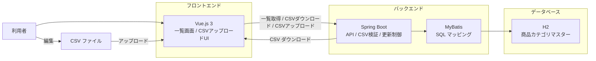

# 商品カテゴリマスター管理システム MVP 要件定義

## 1. 目的

本システムは、商品カテゴリマスターを Web UI から参照し、CSV でダウンロードおよびアップロードして一括更新できるようにすることを目的とする。

本ドキュメントでは、AI エージェントを使った開発の題材として、まずローカルで完結する MVP を定義する。

## 2. MVP の方針

初版では、汎用的なマスター管理基盤ではなく、単一の「商品カテゴリマスター」だけを扱う。

主役となる機能は次の 3 つである。

- 一覧表示
- CSV ダウンロード
- CSV アップロードによる一括更新

初版では、画面上での行単位編集や複雑な権限管理は扱わない。

## 3. 背景

- AI エージェントを使った開発では、要件、画面、API、DB、バリデーションを一通り含む題材が扱いやすい
- 商品カテゴリマスターは列の意味が分かりやすく、CSV 更新の仕様も説明しやすい
- 小さく始めつつ、後から検索や関連マスタ拡張に広げやすい

## 4. スコープ

### 4.1 スコープ内

- 商品カテゴリ一覧の表示
- 商品カテゴリ CSV のダウンロード
- 商品カテゴリ CSV のアップロード
- CSV 内容のバリデーション
- 問題がない場合の DB 一括更新
- エラー内容の画面表示

### 4.2 スコープ外

- 複数マスタ対応
- 画面での個別追加、個別更新、個別削除
- 承認ワークフロー
- 本番デプロイ
- GCP、Kubernetes、CI/CD
- 本格的な認可、監査ログ設計
- 外部システム連携

## 5. 想定利用者

- 開発者: ローカルで動作確認しながら MVP を実装する
- 管理担当者: 商品カテゴリデータを CSV で保守する
- 確認利用者: 一覧や更新結果を確認する

## 6. ユーザーストーリー

- 管理担当者として、現在のカテゴリ一覧を確認したい。なぜなら、作業前に登録済みデータの状態を把握したいから。
- 管理担当者として、現在のカテゴリデータを CSV でダウンロードしたい。なぜなら、既存データをまとめて編集したいから。
- 管理担当者として、編集済み CSV をアップロードして一括更新したい。なぜなら、カテゴリ名や表示順、有効フラグを効率よく反映したいから。
- 管理担当者として、CSV に不備がある場合は行番号付きでエラーを確認したい。なぜなら、どこを修正すればよいかすぐ分かるようにしたいから。
- 確認利用者として、更新後のカテゴリ一覧を見たい。なぜなら、意図した内容に更新されているかを確認したいから。
- 開発者として、ローカル環境で一覧表示から CSV 更新までの一連の操作を再現したい。なぜなら、MVP を素早く検証したいから。

## 7. 管理対象

管理対象は商品カテゴリマスターのみとする。

### 7.1 管理項目

- `category_code`: カテゴリコード
- `category_name`: カテゴリ名
- `display_order`: 表示順
- `is_active`: 有効フラグ
- `description`: 説明

### 7.2 項目要件

#### `category_code`

- 必須
- 一意
- 半角英数字と `_`、`-` を許容候補とする
- CSV および DB 上で主キー相当の識別子として扱う

#### `category_name`

- 必須
- 空文字不可

#### `display_order`

- 必須
- 整数

#### `is_active`

- 必須
- `true/false` または `0/1` のどちらかに統一して扱う
- MVP では実装を簡単にするため、CSV では `true/false` を採用する

#### `description`

- 任意

## 8. 機能要件

### 8.1 一覧表示

- 商品カテゴリ一覧を画面で表示できる
- 表示項目は `category_code`, `category_name`, `display_order`, `is_active`, `description` とする
- 初期表示では `display_order` 昇順、同順位の場合は `category_code` 昇順とする
- MVP ではページングなしでもよい

### 8.2 CSV ダウンロード

- 現在の DB 内容を CSV としてダウンロードできる
- ダウンロードされる CSV にはヘッダー行を含める
- 列順は次の固定順とする
  - `category_code`
  - `category_name`
  - `display_order`
  - `is_active`
  - `description`
- 文字コードは UTF-8 とする

### 8.3 CSV アップロード

- 利用者は編集済み CSV をアップロードできる
- アップロード対象は UTF-8 の CSV のみとする
- ヘッダー行は必須とする
- ヘッダー名はダウンロード形式と一致している必要がある
- データ行が 1 行以上含まれている必要がある

### 8.4 CSV バリデーション

- 必須項目未入力を検知できる
- `category_code` の重複を検知できる
- `display_order` が整数でない場合はエラーにする
- `is_active` が `true` または `false` でない場合はエラーにする
- 想定外の列構成であればエラーにする
- ヘッダーのみでデータ行が存在しない CSV はエラーにする

### 8.5 更新方式

- MVP では、CSV アップロード成功時に商品カテゴリマスターを全件入れ替えする
- バリデーションエラーが 1 件でもある場合は更新しない
- 更新処理はトランザクション内で行い、失敗時はロールバックする

### 8.6 エラー表示

- CSV エラー時は、少なくとも次を返せるようにする
  - 行番号
  - 項目名
  - エラー内容
- 画面では複数エラーを一覧で確認できる

## 9. 画面要件

MVP では、商品カテゴリ一覧と CSV アップロード操作を 1 画面内にまとめて提供する。

- 商品カテゴリ一覧画面
- CSV アップロード操作領域

### 9.1 一覧画面

- 商品カテゴリ一覧を表形式で表示する
- CSV ダウンロードボタンを配置する
- CSV アップロード操作へ自然に遷移または展開できる

### 9.2 アップロード UI

- CSV ファイル選択ができる
- アップロード実行ができる
- 成功時は更新完了メッセージを表示する
- 失敗時はエラー件数と詳細を表示する

## 10. API 要件

MVP では少なくとも次の API が必要である。

- 商品カテゴリ一覧取得 API
- 商品カテゴリ CSV ダウンロード API
- 商品カテゴリ CSV アップロード API

### 10.1 一覧取得 API

- 商品カテゴリ一覧を返す
- MVP では検索条件なしでもよい

### 10.2 CSV ダウンロード API

- 現在のマスター内容を CSV ファイルとして返す

### 10.3 CSV アップロード API

- CSV ファイルを受け取る
- バリデーション結果を返す
- 正常時は全件入れ替えを実行する

## 11. データベース要件

### 11.1 ローカル開発 DB

ローカル開発では `MySQL` より `H2` を優先して採用する。

理由:

- セットアップが軽い
- ローカルで素早く試せる
- MVP 検証の初速を上げやすい

### 11.2 実装上の注意

- 将来 `MySQL` へ切り替えやすいよう、DB 依存の強い SQL は増やしすぎない
- DDL とアプリケーションコードは、H2 固有機能への依存を最小化する
- MyBatis の SQL でも移植性を意識する

### 11.3 テーブルの最低要件

商品カテゴリテーブルには少なくとも次の列を持つ。

- `category_code`
- `category_name`
- `display_order`
- `is_active`
- `description`

必要に応じて以下も追加候補とする。

- `created_at`
- `updated_at`

## 12. 技術構成

MVP の想定技術構成は次の通りとする。

- フロントエンド: `Vue.js 3`
- バックエンド: `Spring Boot`
- データアクセス: `MyBatis`
- ローカル開発 DB: `H2`

## 13. ハイレベル構成

本 MVP のシステム構成は次のイメージとする。

- 利用者は Web UI から一覧表示、CSV ダウンロード、CSV アップロードを行う
- `Spring Boot` は API 提供、CSV バリデーション、全件入れ替え更新の制御を担う
- `MyBatis` は商品カテゴリマスターに対する SQL 実行を担う
- `H2` はローカル開発用 DB として商品カテゴリマスターを保持する

## 14. 非機能要件

### 14.1 性能

- ローカル利用で快適に動作すること
- 商品カテゴリマスター程度の小規模データを即時に一覧表示できること

### 14.2 可観測性

- CSV 取り込み失敗時に原因を追えるログを出せること

### 14.3 保守性

- 画面、API、CSV 処理、DB アクセスの責務が分かれていること
- 将来ほかのマスタへ横展開しやすい構成を意識すること

## 15. 受け入れ条件

MVP 完了の判断基準は次の通りとする。

- 商品カテゴリ一覧が画面に表示される
- 一覧内容を CSV ダウンロードできる
- ダウンロードした CSV を編集して再アップロードできる
- 正常な CSV は DB に反映される
- 不正な CSV は更新されず、エラー内容が画面で分かる
- ローカル環境で一連の操作が再現できる

## 16. 今後の拡張候補

- 検索、絞り込み
- ページング
- 個別編集画面
- 変更履歴
- 複数マスタ対応
- 商品マスターなど他テーブルとの関連
- `MySQL` または `PostgreSQL` への切り替え
